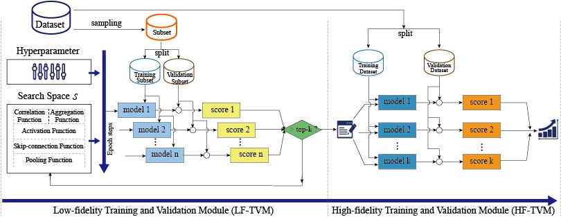
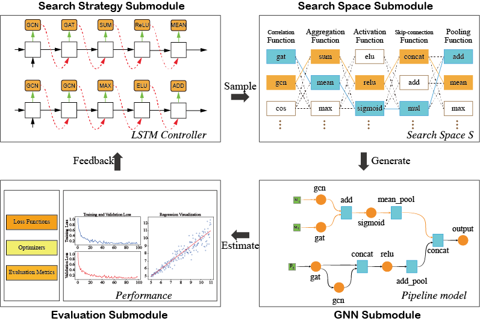

# Adapt-DTA: An Adaptive Learning Framework for Drug-Target Affinity Prediction using Reinforcement Learning and Graph Neural Network
## Introduction
This is a PyTorch implementation of the research: [Adapt-DTA: An Adaptive Learning Framework for Drug-Target Affinity Prediction using Reinforcement Learning and Graph Neural Network](https://github.com/happay-ending/Adapt-DTA)

This repository contains a brief description of the paper, source code, data and program run instructions.

----
In the field of biomedical engineering, predicting Drug-Target Affinities (DTAs) is crucial. However, current DTA prediction models are predominantly manually designed, which is a complex, time-consuming process that may not effectively accommodate the diversity and complexity of datasets. To address this challenge, we propose an Adaptive Learning Framework (Adapt-DTA) that integrates Reinforcement Learning (RL) with Graph Neural Networks (GNNs) to automate the design of DTA prediction models. Adapt-DTA defines the GNN architecture search space using Directed Acyclic Graphs (DAGs) and employs an RL algorithm to guide the architecture search, optimizing parameters based on the entropy of sampled architectures and model performance metrics. Additionally, we enhance efficiency with a two-stage training and validation strategy, incorporating low-fidelity and high-fidelity evaluations. Our framework not only mitigates the challenges associated with manual model design but also significantly improves model performance and generalization. To evaluate the performance of Adapt-DTA, we conducted extensive experiments and compared its results with nine state-of-the-art methods on Davis, KIBA, and BindingDB datasets. The experimental results demonstrate that our proposed Adapt-DTA outperforms these methods, showcasing its superior achievement in predicting DTAs. Adapt-DTA's innovative approach automates DTA model design, reduces reliance on handcrafting, and enhances model generalization. Its ability to automatically optimize DTA network architectures represents a major step forward in the automation of computational drug discovery processes.

----
## Overview of Adapt-DTA



Adapt-DTA is primarily composed of two core modules: the Low-fidelity Training and Validation Module (LF-TVM) and the High-fidelity Training and Validation Module (HF-TVM). The LF-TVM is responsible for the generation of GNN pipeline models and conducts preliminary training on a sampled subset to filter out $k$ candidate models. The HF-TVM then refines and evaluates these candidates using the full dataset to determine the ultimate optimal pipeline model.

----



Schematic representation of the Low-Fidelity Training and Validation Module (LF-TVM) within the Adapt-DTA framework, illustrating its four independent functional submodules interconnected via API. The Search Space Submodule delineates the foundational operational units, or architecture operators, essential for constructing GNN network architectures, which are utilized by the Search Strategy Submodule for network exploration and management. The latter employs RL algorithms to navigate the search space, sampling operators and generating a sequence of network architectures. The generated pipeline model's Reward is determined based on the network architecture's information entropy and feedback from the GNN Submodule, guiding the adjustment of the search algorithm's parameters and the updation of a fixed-length queue that retains the performance metrics of the top-$k$ candidate models. The GNN Submodule is responsible for interpreting the architecture sequence to construct the GNN pipeline model, processing graph data of drugs and proteins alongside hyperparameter configurations, and executing model training and prediction. The results are then relayed back to the search strategy submodule. Lastly, the Evaluation Submodule establishes evaluation metrics, loss functions, and optimizers to assess the efficacy of the produced GNN architectures.

----
## Dependencies
```
Name	Version
biopython	1.81
gensim	3.8.3
networkx	2.6.3
nni	2.8
numpy	1.21.6
numpy-base	1.21.5
pandas	1.3.5
python	3.7.16
rdkit	2020.09.1.0
scikit-learn	1.0.2
scipy	1.7.3
torch	1.12.1+cu116
torch-cluster	1.6.0+pt112cu116
torch-geometric	2.2.0
torch-scatter	2.1.0+pt112cu116
torch-sparse	0.6.16+pt112cu116
torch-spline-conv	1.2.1+pt112cu116
torchmetrics	0.11.4
torchvision	0.13.1+cu116
tqdm	4.65.0

```
----
## Using
Run the  program using the following command:
```
python main.py
```

**notes**: You can specify the dataset, epochs, layers, etc. in the run parameters. 

The results are stored in the `log` folder after the program is run, and the training model parameters are stored in `./checkpoint/`. 

## About data

We provided the raw data for the Davis, KIBA, and BindingDB datasets, respectively, which are located under the corresponding file paths.


